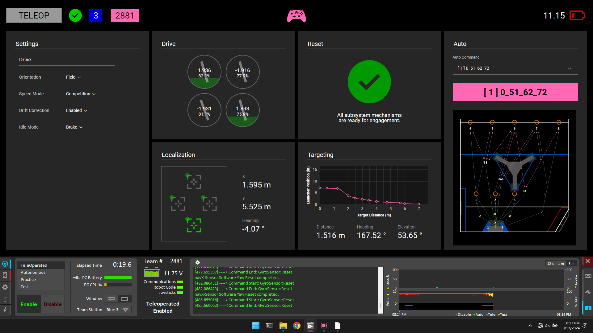
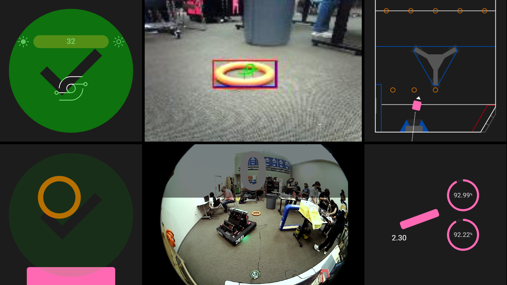
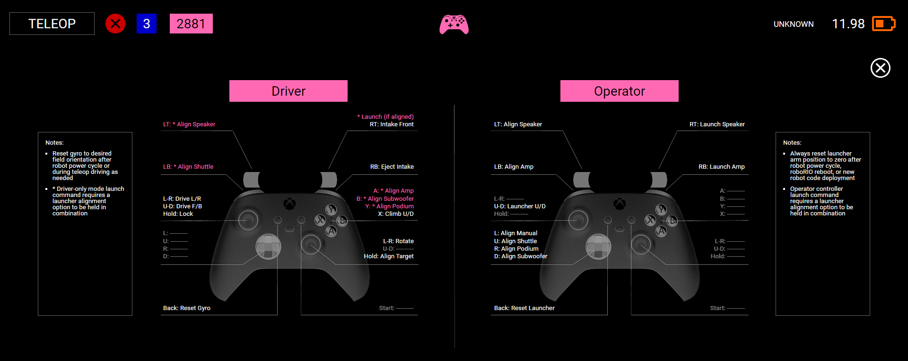

# Driver Station App

Not Shuffleboard or Elastic. Just a modern web app hosted in Electron for the driver station desktop customized for the current season's game and Lady Cans robot capbilities.

_Note: more complete configuration and usage documentation is TBD_

## Views (2024.1.2 - Crescendo)

### Dashboard (primary notebook screen docked to NI driver station app)
* Robot, battery and game status indicators
* Auto command selection and field traveral visulaization
* Mechanism reset status indicator for robot safety
* Drive train status and performance metrics
* Robot localization and vision telemetry with AprilTag acquisition and pose estimation
* Targeting calculation graph and status for linear interpolation between target distance and launcher elevation
* Discreet robot configuration settings for drive and other subsystems

### HUD (heads-up display on secondary monitor for drive team)
* Game piece intake status indicator with sensor values and internal position
* External game piece object detection and intake alignment indicator
* Floor-facing camera stream with object detection overlay
* Driver station camera stream with fisheye view for driver station wall observation
* Current match time overlay
* Scoring target alignment visualization based on real-time localization data
* Launcher subsystems status and performance indicators for elevation and speed

### Controller Map

### Demo

## Tech Stack

* [Electron](https://www.electronjs.org/)
* [TypeScript](https://www.typescriptlang.org/)
* [Svelte](https://svelte.dev/)
* [IBM Carbon Components](https://svelte.carbondesignsystem.com/)
* [msgpack](https://msgpack.org/)
* [ws (Websockets)](https://github.com/websockets/ws)
* [Rollup](https://rollupjs.org/)
* [Node / npm](https://nodejs.org/en)

## Dependencies

* [Volta](https://docs.volta.sh/guide/getting-started)

## Install / Configuration

* `volta install node`
* `npm install`

## Build / Run

* Run robot simulation in local environment OR run live robot and connect remotely
* Development
  * `npm run dev:local` (builds and runs the app locally for development with live UI refresh on edit/save connecting to localhost)
* Binary packaging and distribution
  * `npm run package` (builds and packages Windows portable executable file for simple copy distribution to driver station)
* Other
  * See `scripts` section in `package.json` file for more options
